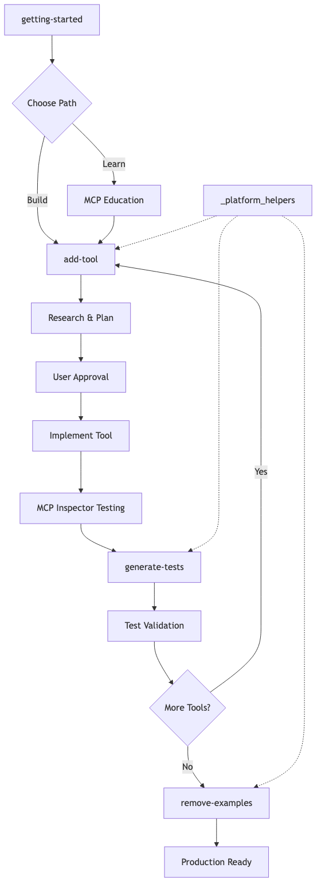

# Claude Commands Analysis: MCP Development Workflow

## Overview

This document serves as an **example of AI-assisted developer onboarding** through custom Claude commands. It analyzes how I use the `.claude/commands` directory to create guided learning experiences that help new contributors quickly understand and contribute to open source repositories.

**Purpose for AI Assistants**: This is a reference example showing how custom commands can transform complex technical onboarding from overwhelming documentation dumps into interactive, step-by-step learning experiences. The commands demonstrate how AI can teach developers by:

- **Progressive disclosure**: Breaking complex concepts into digestible, sequential steps
- **Interactive guidance**: Providing hands-on experience with immediate feedback
- **Context-aware assistance**: Understanding where developers are in their journey
- **Safety nets**: Preventing common mistakes through automated checks
- **Research integration**: Teaching current best practices, not outdated training data

**The Pattern**: Instead of expecting developers to read lengthy documentation and figure things out themselves, these custom commands create **AI-powered mentorship** that guides them through the entire development workflow - from learning concepts to building production-ready code.

This MCP Cookie Cutter project's command system demonstrates how to design **scalable developer education** that works 24/7, adapts to different experience levels, and ensures consistent quality across all contributors.

**Educational Context**: This approach is part of the teaching methodology I use through my **Coding the Future with AI** company, YouTube channel, and SKOOL.com community. It represents the type of AI-assisted learning content and methods I develop to help developers master complex technologies through structured, interactive experiences rather than traditional documentation-heavy approaches.

The commands form an integrated development system designed to help developers create, test, and deploy MCP servers with advanced features like decorators, logging, and parallel processing - but more importantly, they show how AI can be structured to **teach while doing**.

## Core Purpose: Guided MCP Server Development

The command system transforms MCP server development from manual, error-prone coding into a guided, research-backed, test-driven development process that produces production-ready servers with advanced monitoring and parallel processing capabilities.

## The Five Commands & Their Roles

### 1. `getting-started.md` - The Entry Point
- **Purpose**: Interactive onboarding with 3 learning paths
- **Key Features**:
  - Path 1: MCP basics for beginners
  - Path 2: Server architecture for experienced MCP users  
  - Path 3: Jump straight to building
- **Critical Safety**: Prevents environment setup mistakes (venv already exists)
- **Teaches**: The unique decorator pattern that distinguishes this server from standard MCP implementations

### 2. `add-tool.md` - The Main Development Command
- **Purpose**: End-to-end tool creation with research, planning, and implementation
- **Workflow**:
  1. **Research Phase**: Uses Context7 or web search for current library documentation
  2. **Planning Phase**: Creates detailed implementation plan based on research
  3. **Approval Gate**: Waits for user approval before proceeding
  4. **Implementation**: Creates tool following MCP compatibility rules
  5. **Testing**: Launches MCP Inspector for live testing
- **Key Innovation**: Never uses training data - always researches current documentation

### 3. `generate-tests.md` - Quality Assurance
- **Purpose**: Creates comprehensive unit and integration tests
- **Features**:
  - Studies existing test patterns from `.reference/` directory
  - Generates both success and failure test cases
  - Follows MCP client testing patterns
  - Creates NEW test files (never modifies existing ones)
- **Integration**: Works with the server's decorator system

### 4. `remove-examples.md` - Production Cleanup
- **Purpose**: Removes example tools while preserving architecture
- **Critical Design**: 
  - Only modifies import statements
  - **Never touches registration loops** (described as "SACRED")
  - Maintains the elegant tool registration system
- **Safety**: Multiple warnings about what NOT to modify

### 5. `_platform_helpers.md` - Cross-Platform Support
- **Purpose**: Reference guide for Windows/Mac/Linux compatibility
- **Covers**: Process management, path handling, virtual environments
- **Integration**: Used by other commands for platform-specific operations

## Command Workflow Diagram



The workflow shows how commands interconnect:
1. **Entry**: `getting-started` provides three learning paths
2. **Development**: `add-tool` handles the main development cycle
3. **Quality**: `generate-tests` ensures comprehensive testing
4. **Production**: `remove-examples` cleans up for deployment
5. **Support**: `_platform_helpers` provides cross-platform compatibility

## Unique Architecture Features

### Decorator-Based Tool Registration
Unlike standard MCP servers that use `@mcp.tool` decorators on individual functions, this system:
- Applies decorators programmatically in registration loops
- Provides automatic: exception handling, logging, type conversion, SQLite logging, parallelization
- Keeps tool code clean and focused on business logic

**Standard MCP Pattern:**
```python
@mcp.tool
async def my_tool(): 
    ...
```

**This System's Pattern:**
```python
# In app.py registration loops:
for func in [tool1, tool2]:
    decorated = exception_handler(func)
    decorated = tool_logger(decorated) 
    decorated = type_converter(decorated)
    app.tool()(decorated)
```

### Research-First Development
- **Context7 Integration**: Prioritizes current documentation over training data
- **Mandatory Research Phase**: Every tool creation includes library research
- **Version-Aware**: Always checks for latest API versions and breaking changes

### Compatibility-First Design
- **MCP Compatibility Rules**: Enforces `NO Optional[...]` types (breaks MCP clients)
- **Cross-Platform**: Handles Windows/Mac/Linux differences
- **Type Safety**: Automatic string-to-type conversion for MCP parameters

## Development Workflow

### Complete Development Cycle:

1. **Start**: `@getting-started` - Learn the system
2. **Build**: `@add-tool [description]` - Create tools with research and testing
3. **Validate**: `@generate-tests [tool-name]` - Comprehensive test coverage
4. **Iterate**: Repeat add-tool/generate-tests cycle
5. **Deploy**: `@remove-examples` - Clean production-ready server

### Tool Creation Process (add-tool):

1. **Environment Check**: Verify no running MCP processes
2. **Context7 Availability**: Test research tool availability
3. **Library Research**: Research all required libraries/APIs
4. **Design Planning**: Create detailed implementation plan
5. **User Approval**: Wait for explicit approval before coding
6. **Implementation**: Generate tool following compatibility rules
7. **Registration**: Add to server with decorator chain
8. **Testing**: Launch MCP Inspector for live testing
9. **Validation**: User tests and reports results

### Test Generation Process (generate-tests):

1. **Pattern Study**: Analyze existing test patterns
2. **Compatibility Check**: Verify no Optional parameters
3. **Test Creation**: Generate comprehensive test suites
4. **File Management**: Create NEW test files (never modify existing)
5. **Execution**: Provide testing instructions and debug support

## Key Innovations

### Process Management
- **Automatic Detection**: Finds running MCP processes
- **Smart Cleanup**: Kills only project-related processes
- **Conflict Prevention**: Ensures clean environment for operations

### Browser Tab Management
- **Connection Issues**: Handles MCP Inspector connection problems
- **Tab Cleanup**: Prevents "Error Connecting" issues
- **Fresh Sessions**: Ensures clean testing environment

### Approval Gates
- **Human Oversight**: Critical decision points require user approval
- **Plan Review**: Detailed implementation plans before coding
- **Change Management**: Revision cycles for plan improvements

### Reference Architecture
- **Pattern Preservation**: Maintains `.reference/` directory patterns
- **Consistency**: Ensures all generated code follows established patterns
- **Best Practices**: Codifies MCP development best practices

### Sacred Code Protection
- **Registration Loops**: Prevents modification of core server architecture
- **Import-Only Changes**: Limits modifications to safe import statements
- **Architecture Preservation**: Maintains elegant tool registration system

## Critical Design Principles

### 1. Never Use Optional Types
```python
# ❌ BREAKS MCP clients:
def tool(param: Optional[str] = None): ...

# ✅ WORKS with MCP clients:
def tool(param: str = ""): ...
```

### 2. Research Before Implementation
- Always use current documentation
- Never rely on training data
- Verify library versions and API changes

### 3. Cross-Platform Compatibility
- Handle Windows/Mac/Linux differences
- Use pathlib for path operations
- Provide platform-specific command examples

### 4. Process Hygiene
- Check for running processes before operations
- Clean up after testing
- Prevent resource conflicts

### 5. Preserve Core Architecture
- Never modify registration loops
- Only change import statements
- Maintain decorator chain integrity

## File Structure Impact

The commands work with this project structure:
```
project/
├── .claude/commands/          # Command definitions
├── tools/                     # Tool implementations
├── tests/                     # Test suites
├── .reference/               # Pattern templates
└── {{cookiecutter.__project_slug}}/server/app.py  # Registration logic
```

## Production Readiness

The command system ensures production-ready output through:

1. **Comprehensive Testing**: Both unit and integration tests
2. **Error Handling**: Robust exception management via decorators
3. **Monitoring**: Built-in logging and SQLite persistence
4. **Performance**: Parallel processing for batch operations
5. **Compatibility**: Cross-platform and MCP client compatibility
6. **Documentation**: Comprehensive docstrings and examples

## Conclusion

This Claude command system represents a sophisticated approach to MCP server development that:

- **Guides developers** through complex MCP concepts
- **Enforces best practices** through automated checks
- **Prevents common mistakes** via compatibility rules
- **Ensures quality** through comprehensive testing
- **Maintains architecture** through protected core components
- **Enables rapid development** through research-backed automation

The result is a development workflow that produces high-quality, production-ready MCP servers with advanced features that would be difficult to implement correctly without this guided approach.
